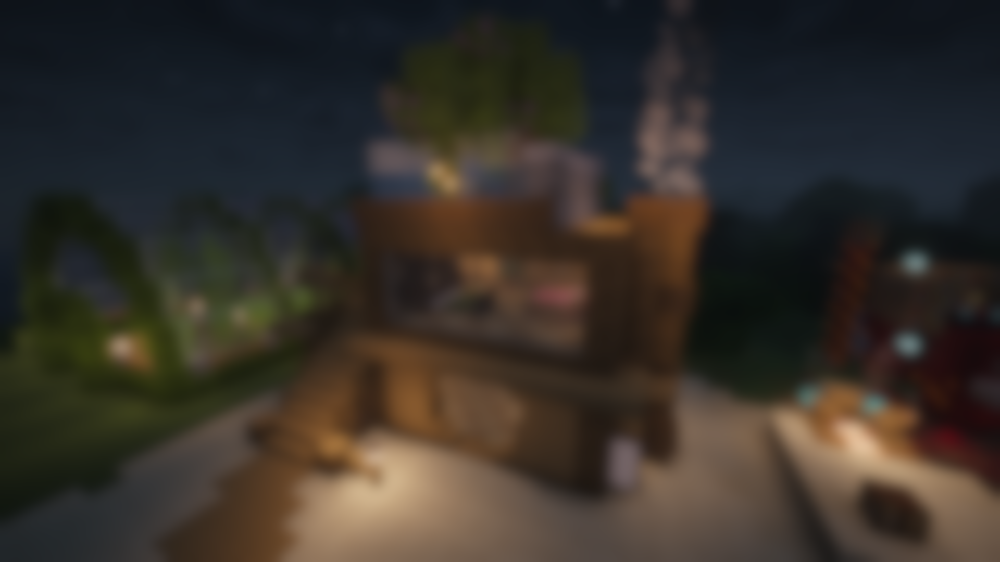
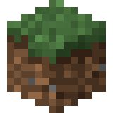

  

---
# Vanillina: Enchantment Additions

###

  

*Improves the enchanting system in a way that makes the game less grindy and more relaxing.*

---

>
>## *The Vanillina Family*
>*Vanillina is a family of mods that adds small vanilla-feeling additions and patches to the base game.*

---

## Setup

For setup instructions, please see the [Fabric Documentation page](https://docs.fabricmc.net/develop/getting-started/creating-a-project#setting-up) related to the IDE that you are using.

## License & Note

#### This mod is available under the MIT license.
Additionally, if you are to copy relevant parts of this code or include this in a modpack, 
feel free to credit me!
